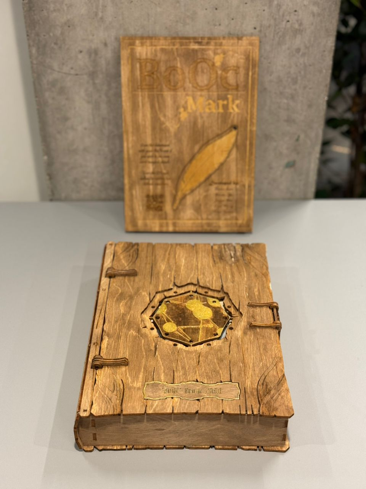
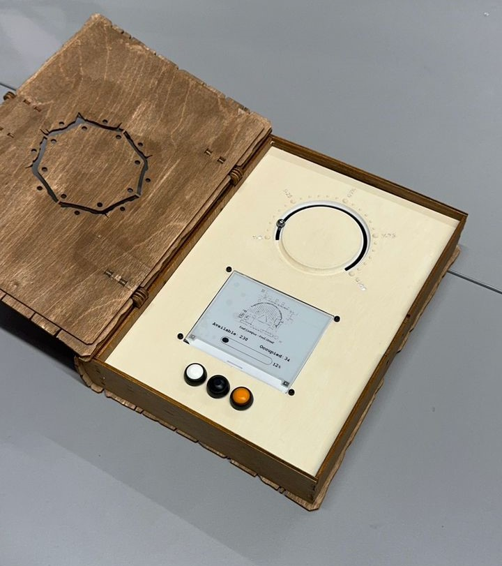
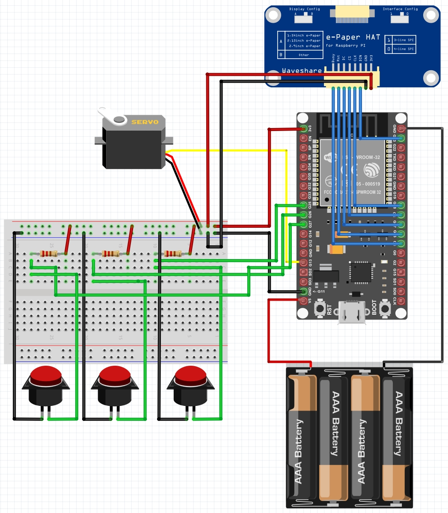
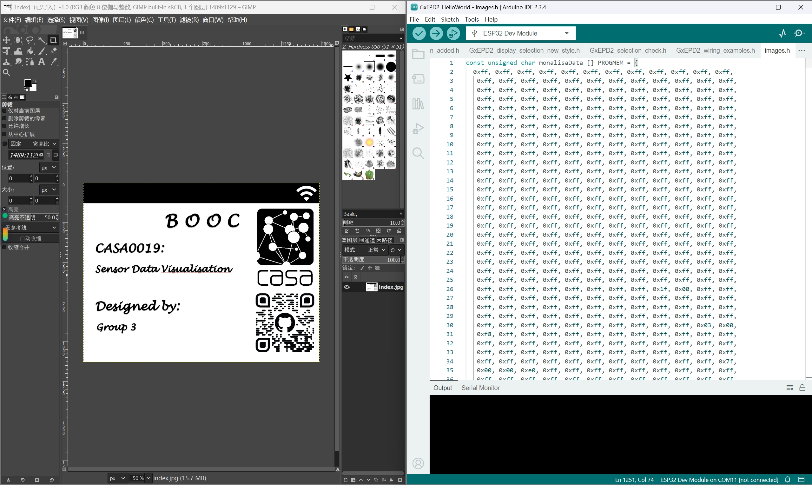
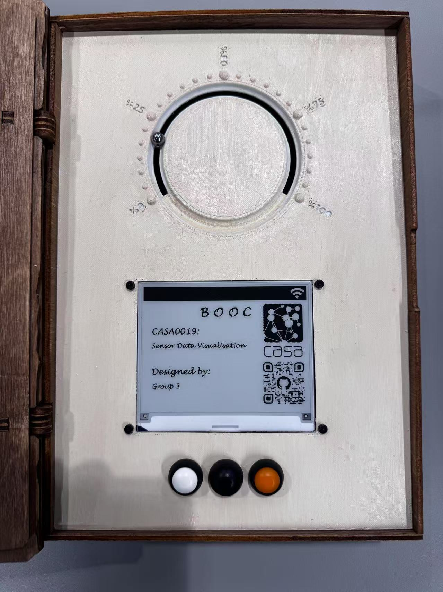

---

# BoOC — UCL Library Occupancy Visualizer

  

<b>Pic.1:</b> Static mode: No timing at this time.

## Project Overview
This group project is a data-visualizing device designed to acquire and display information about the occupancy levels of three libraries on the UCL campus using the UCL API. The device's core features a gauge housed within a book enclosure, which shows the selected library's live occupancy level in percentages for any given time between 9:00 and 17:00.

The integrated app for this device also generates a 3D augmentation of the book. It displays a detailed dashboard of information for each selected library, controlled by the buttons on the book. This device helps users better understand the state of each library through various mediums and visualizations.

For more information please visit [our website](https://siruiluo.github.io/casa0019-BOOC/)

## Key Components
1. **MCU ESP32 DEVKIT V1**
2. **300 Degree Servo**
3. **Waveshare 4.2 inch E-Ink Screen**

## Enclosure Design
The device's design stemmed from the idea of a classic library with all the books. Making a book as a storytelling device and incorporating the technology of IoT within the book was a close-to-magic juxtaposition, restating the idea of the technology itself that has been regarded as a sort of magic for decades (McEwen, A, & Cassimally, H 2013). 

The idea was to build a boxed device that could sit on a desk and look like an old vintage book. Inside the book, a gauge blended on a surface, resembling a paper page, shows the occupancy level percentage inside each chosen library by feeding on live data from the API. The idea of showing the map of the libraries has also led to a decision to use a screen in the device. However, to maintain the style and theme of the project, the digital screen was replaced with an E-ink screen. For user integration, three buttons were placed on the surface to control the information displayed on the E-ink screen and to choose between three different libraries. All these components were placed in a unique composition, and the 3D-printed surface was painted on warm white (creating a paper effect) to give the device a vintage feel (Pic.1). In the gauge design, instead of using a simple pointer like a clock or a regular pin, a metal ball was placed on a round rail to show the percentage. Three main issues were to be considered when designing the gauge. First, the use of a servo and the range of the angular movement of the pin. Second, the distance between the magnet attached to the servo pin and the metal ball. Finally, the readability of the numbering and index design are shown (Pic.2). 

  
   
  <b>Pic.1:</b> color test for making a vintage paper   look for the gauge

  
   
  <b>Pic.2:</b> The gauge design features with the   metal ball, the E-ink and the Buttons

This design had several advantages for the project. First, its box-like shape offered enough space inside to house all the components, including the servo and the power battery, which were the most significant components of the device. It also allowed the magnetic ball to be used on a flat surface, ensuring it moved smoothly and accurately. Lastly, the placement of the e-ink on the page made the whole page look coherent while allowing the user to access all the required data from the physical device. 
For the digital augmentation of the device, there had to be a physical trigger, such as a QR code or a distinguished marker that Unity could recognize. This marker was designed in Adobe Illustrator and was laser-cut and painted to complete the BoOc's look (Pic.3). The concept used a feather-shaped bookmark as a trigger that was scanned through the app, and the 3D model of the device was placed on the designed marker in AR. The challenge of the marker design was building something the algorithm could recognize. Despite Trying different methods like creating a unique shape or coloring the marker in red, the algorithm did not recognize the marker. Therefore, using a QR code was the last option for triggering the AR on the app.

  
   
  <b>Pic.3:</b> Laser cutting The BoOc Marker design with the shape of a feather

## Hardware Part

1. Components & Schematic

The hardware of BoOC, in addition to the casing, includes a Waveshare 4.2-inch E-ink screen, an ESP32 DEVKIT V1, a 300 degree servo, a power bank, three spring switches, three 1k ohm resistors and several wires. ESP32 directly receives battery power and distributes electrical energy to other components. Pin 13 is used to control the servo, while pins 25, 26, and 27 are used to control three switches embedded with pull-up resistors. The specific schematic diagram (Pic.4) and the real circuit (Pic.5) are as follows:

  
   
  <b>Pic.4:</b> Schematic Diagram

  
   
  <b>Pic.5:</b> The Circuit in BoOC

2. Code & Logic

2.1 Data Acquisition & Network Services 

For data acquisition, UCL's two APIs in Workspace were used to obtain occupancy data for three libraries, divided into two categories: one is the occupancy situation of each floor of the library within one minute, and the other is the occupancy statistics of the library throughout the day. Therefore, six string variables are set in the code to store the URL of the API. For the initial data filling, first define a three-dimensional container that can accommodate three different library data to store the first type of data, then set up a regular container to store the second type of data. Secondly, enable the WiFi service in the setup function to connect to the network, start HTTPClient, and then go to http After successfully connecting to the API, the GET () function retrieves the JSON data from the API, decodes it, and hierarchically stores it in an array defined by the macro for future use. Afterwards, connect to the MQTT client and send an activation message to activate the digital dashboard on the mobile device.

2.2 Interface Design

In this part, I used the GxEPD2 library to develop Eink screens with ESP32. But the GxEPD2 library cannot fully support all ESP32 boards on the market. After testing, this library is not fully available for my development board. But after modifying some of the hardware drivers with low-level I2C serial ports and reconstructing the underlying functions for controlling multiple screen pixels, this problem was solved. Secondly, due to the fact that development boards based on Arduino IDE do not have the ability to directly store native images such as JPG, displaying images on Eink can only be done by translating the images into binary matrices and storing them in PROMEM according to Eink's coloring rules. Therefore, I used GIMP to translate the images, generated binary XBM files, and stored the translated results in different PROMEM arrays in images. h, as follows (Pic.6):

  
   
  <b>Pic.6:</b> GIMP and Binary Picture Storage

After drawing elements that will not change on different interfaces, such as maps and artistic fonts, I encapsulated progress bars for displaying occupancy rates and label functions for displaying percentages, and extracted data in real-time from macro defined arrays and implanted them into these functions to achieve interface data visualization.

**2.3 Buttons and Servo**

The button is used to switch pages, and the three buttons correspond to three different libraries. Therefore, I designed a counter to monitor the number of times the button is pressed, which is used to determine whether to switch between pages belonging to this library or other libraries. Pressing the same button can switch pages according to "Home" - "Map and total occupancy rate of this library" - "Occupancy rate of different floors of this library". Every time you switch to 'Map of this library and total occupancy rate', the rotation of the servo will be triggered. As the occupancy rate from 0% to 100% has already been mapped to an angle of 0 to 270 degrees during shell modeling, the servo will slowly rotate to the corresponding percentage. Below is the index page design (Pic.7):

  
   
  <b>Pic.7:</b> Index Page Design

