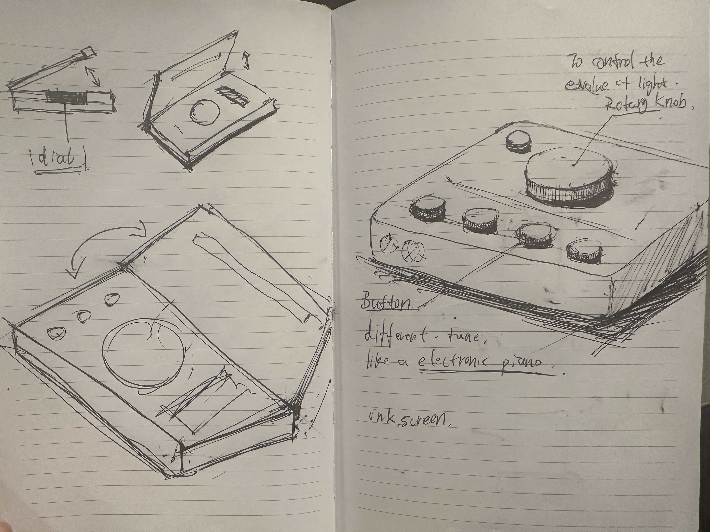
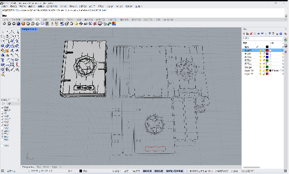
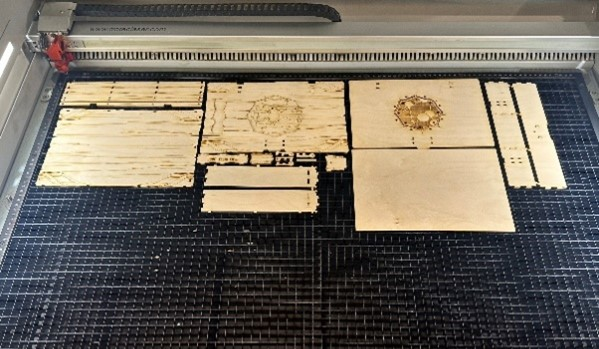
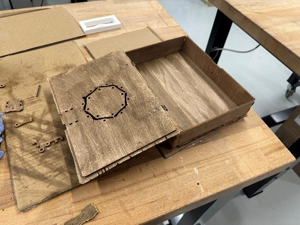

---

# BoOC — UCL Library Occupancy Visualizer

  

<b>Pic.1:</b> Static mode: No timing at this time.

## Project Overview
This group project is a data-visualizing device designed to acquire and display information about the occupancy levels of three libraries on the UCL campus using the UCL API. The device's core features a gauge housed within a book enclosure, which shows the selected library's live occupancy level in percentages for any given time between 9:00 and 17:00.

The integrated app for this device also generates a 3D augmentation of the book. It displays a detailed dashboard of information for each selected library, controlled by the buttons on the book. This device helps users better understand the state of each library through various mediums and visualizations.

For more information please visit [our website](https://siruiluo.github.io/casa0019-BOOC/)

You can also download our unity project here [Unity Project Download](https://1drv.ms/f/c/ee96ebd5e6dae7dd/El8WtXRRXjxGldyxN23Vm7QBUEwUizNbPhsP_ulCAJ-BRA?e=ek8Ldj)
## Key Components
1. **MCU ESP32 DEVKIT V1**
2. **300 Degree Servo**
3. **Waveshare 4.2 inch E-Ink Screen**

## Design Concept
The device's design stemmed from the idea of a classic library with all the books. Making a book as a storytelling device and incorporating the technology of IoT within the book was a close-to-magic juxtaposition, restating the idea of the technology itself that has been regarded as a sort of magic for decades (McEwen, A, & Cassimally, H 2013). 

  
   
  <b>Draft of the enclosure</b>

After the "Magic Book" concept was finalised, the design keywords were obtained through brainstorming, such as "unique, interactive, effective, and appealing." After setting up several design styles that fit the keywords, such as "ancient and mysterious" and "high-tech.", a magical, whimsical, and mysterious style was preferred. Representative movies and TV shows like Harry Potter were used as visual style references to make the IoT technology enjoyable. The design concept of the final product is perfectly reflected by the retro and mysterious book cover and the CASA logo, which symbolises the connection of all things.

## Enclosure Design
The design phase involved four aspects of the book: size, structure, material, and details. In the size section, the prime operation was to calculate and test the internal space, place the required hardware in 3D software, RHINO, and determine the final size that could accommodate all the components and be suitable for hand-held, which is 260mm in length,180mm in width and 44mm in height. The structure section focused on the hinge design and tested how the dimensions in the switching state would impact the internal components. In terms of materials, to fit in with style, we chose the 3mm composite wood boards, which are wooden in colour with wood grain. For details, some tiny cracks and irregular notches were added to enhance the visual effect and style. 

Inside the book, a gauge blended on a surface, resembling a paper page, shows the occupancy level percentage inside each chosen library by feeding on live data from the API. The idea of showing the map of the libraries has also led to a decision to use a screen in the device. However, to maintain the style and theme of the project, the digital screen was replaced with an E-ink screen. For user integration, three buttons were placed on the surface to control the information displayed on the E-ink screen and to choose between three different libraries. All these components were placed in a unique composition, and the 3D-printed surface was painted on warm white (creating a paper effect) to give the device a vintage feel (Pic.1). In the gauge design, instead of using a simple pointer like a clock or a regular pin, a metal ball was placed on a round rail to show the percentage. Three main issues were to be considered when designing the gauge. First, the use of a servo and the range of the angular movement of the pin. Second, the distance between the magnet attached to the servo pin and the metal ball. Finally, the readability of the numbering and index design are shown (Pic.2). 

  
   
  <b>Pic.1:</b> color test for making a vintage paper   look for the gauge

  
   
  <b>Pic.2:</b> The gauge design features with the   metal ball, the E-ink and the Buttons

This design had several advantages for the project. First, its box-like shape offered enough space inside to house all the components, including the servo and the power battery, which were the most significant components of the device. It also allowed the magnetic ball to be used on a flat surface, ensuring it moved smoothly and accurately. Lastly, the placement of the e-ink on the page made the whole page look coherent while allowing the user to access all the required data from the physical device. 
For the digital augmentation of the device, there had to be a physical trigger, such as a QR code or a distinguished marker that Unity could recognize. This marker was designed in Adobe Illustrator and was laser-cut and painted to complete the BoOc's look (Pic.3). 

  
   
  <b>Pic.3:</b> Laser cutting The BoOc Marker design with the shape of a feather

## Fabrication

  
  

  
  

Based on the need for a wood effect, the shell was laser cut rather than 3D printed. With the aid of 3D modelling, a flat pattern was drawn for the laser cut, and the two modes of penetration and carving were differentiated to obtain a wood piece with a ‘cracked’ effect. Since the only material available was a new glossy wood-coloured composite template, the acrylic paints should be mixed to colour the boards to generate an ‘old wood’ effect. The following step was sanding the sharp edges, and the logo was painted bright gold. Finally, all the pieces were assembled into the finished device housing.
## Hardware Part

**1. Components & Schematic**

The hardware of BoOC, in addition to the casing, includes a Waveshare 4.2-inch E-ink screen, an ESP32 DEVKIT V1, a 300 degree servo, a power bank, three spring switches, three 1k ohm resistors and several wires. ESP32 directly receives battery power and distributes electrical energy to other components. Pin 13 is used to control the servo, while pins 25, 26, and 27 are used to control three switches embedded with pull-up resistors. The specific schematic diagram (Pic.4) and the real circuit (Pic.5) are as follows:

  
   
  <b>Pic.4:</b> Schematic Diagram

  
   
  <b>Pic.5:</b> The Circuit in BoOC

**2. Code & Logic**

2.1 Data Acquisition & Network Services 

For data acquisition, UCL's two APIs in Workspace were used to obtain occupancy data for three libraries, divided into two categories: one is the occupancy situation of each floor of the library within one minute, and the other is the occupancy statistics of the library throughout the day. Therefore, six string variables are set in the code to store the URL of the API. For the initial data filling, first define a three-dimensional container that can accommodate three different library data to store the first type of data, then set up a regular container to store the second type of data. Secondly, enable the WiFi service in the setup function to connect to the network, start HTTPClient, and then go to http After successfully connecting to the API, the GET () function retrieves the JSON data from the API, decodes it, and hierarchically stores it in an array defined by the macro for future use. Afterwards, connect to the MQTT client and send an activation message to activate the digital dashboard on the mobile device.

2.2 Interface Design

In this part, I used the GxEPD2 library to develop Eink screens with ESP32. But the GxEPD2 library cannot fully support all ESP32 boards on the market. After testing, this library is not fully available for my development board. But after modifying some of the hardware drivers with low-level I2C serial ports and reconstructing the underlying functions for controlling multiple screen pixels, this problem was solved. Secondly, due to the fact that development boards based on Arduino IDE do not have the ability to directly store native images such as JPG, displaying images on Eink can only be done by translating the images into binary matrices and storing them in PROMEM according to Eink's coloring rules. Therefore, I used GIMP to translate the images, generated binary XBM files, and stored the translated results in different PROMEM arrays in images. h, as follows (Pic.6):

  
   
  <b>Pic.6:</b> GIMP and Binary Picture Storage

2.3 Buttons and Servo

The button is used to switch pages, and the three buttons correspond to three different libraries. Therefore, I designed a counter to monitor the number of times the button is pressed, which is used to determine whether to switch between pages belonging to this library or other libraries. Pressing the same button can switch pages according to "Home" - "Map and total occupancy rate of this library" - "Occupancy rate of different floors of this library". Every time you switch to 'Map of this library and total occupancy rate', the rotation of the servo will be triggered. As the occupancy rate from 0% to 100% has already been mapped to an angle of 0 to 270 degrees during shell modeling, the servo will slowly rotate to the corresponding percentage. Below is the index page design (Pic.7):

  
   
  <b>Pic.7:</b> Index Page Design

## Project OverviewDashboard Visualization Component Development and Data Parsing and Interaction
**1. Dashboard Design and Style**

To align with the overall theme and the physical device's style, the digital dashboard was created using Unity software. A vintage aesthetic was chosen, consistent with the book-like appearance of the physical device, aiming to provide users with a cohesive and immersive experience. The dashboard features a panel with dimensions of 190mm x 260mm, primarily in wood and beige tones. Its core components include a Pie Chart, Line Chart, Maps, Date and Time Display, Text Prompts, and Library Names. 

They are designed to listen to MQTT's real-time messages from the physical device, ensuring that data is obtained instantly and can react in sync with the physical one. The Pie Chart dynamically visualizes the seat status, and the Line chart displays average occupancy trends over time. The Maps section attempts to provide users with accurate seating layouts. At the same time, both the Time section and TextMeshPros detailing the number of seats are displayed in a clear and concise way. 

 

  
   
  <b>Pic.8:</b> Dashboard Design and Style

**2. Chart Visualizations** 

2.1 Pie Chart 

Positioned in the middle-right section, the pie chart provides a real-time comparison of library seat us-
age, showing the proportions of vacant and occupied seats. This data is derived from the summarize data(see London n.d.(c)) and visualized using code from Summarize.cs. The pie chart enhances data visual- ization and offers users a more intuitive understanding of the library’s status.

2.2 Line Chart 

Located in the middle-left section, the line chart presents trends in hourly average seat occupancy over a week, based on data from average data (see London n.d.(b)). The raw dataset provides ten-minute averages of occupied and vacant seats over seven days. For better readability, only data between 9:00 and 17:00 is displayed, as these are the library’s operational hours. This selective visualization offers users a longer-term perspective on library usage patterns, enabling informed decision-making and providing valuable insights for future predictions regarding the library’s occupancy levels.

2.3 Maps 

Dynamically generated maps, sourced from map_data, are displayed upon switching libraries. These visualizations aim to familiarize users with the spatial layout of the selected library, improving navigation and understanding of the space. 

2.4 TextMeshPro 

The TextMeshPro area mainly displays the current time (date, day, and time) and the library's real-time seating status (number of all seats, occupied seats and empty seats), which enhances the user experience by presenting key survey details. These textual are updated at the same time as the pie chart, ensuring consistency and fluency in data acquisition and presentation.  

According to the MQTT messages received from different buttons, such as buttonValue = "0", "1", "2", the HandleMqttMessage function in Summarize.cs will call different APIs to update the real-time situation of the library.  

**3. MQTT Data Reception and API Parsing**

The primary challenge of the digital system is managing data from MQTT messages and API responses simultaneously. The data transmission workflow begins with the physical device, where users press one of three buttons (labelled 0, 1, and 2), each representing a specific library. This interaction sends data via MQTT to the digital dashboard. The MQTT messages, initially formatted as Python datasets, are decoded into a structure compatible with Unity (implemented in mqttManager.cs).

**4. AR interaction**

4.1 Adding interaction & Image Target Trigger 

We have integrated our Booc dynamic model into the AR environment to enhance immersive visual- ization. The AR Booc displays widgets identical to the physical version, such as the panel and the ball. Using Leantouch and TapToplace, users can place and move the Booc with a double-click, open it with a single click to display animations, rotate it with two fingers, and zoom in or out with three fingers.

By setting up the ReferenceImageLibrary and attaching our bookmark photo to it, combined with an animation of the UCL school gate (quad.fbx), scanning the bookmark with a phone triggers a stunning opening animation.

4.2 Animation 

To enable users to open the book with a single click, we integrated the FBX animation (booc all3) with the Dashboard’s Prefab. We created an AnimatorController (BoocAnimatorController) in the Assets folder, added the booc all3 animation to it, and connected it to the Entry block to ensure smooth animation start. The BoocAnimatorController is then mounted to the Animator component of the booc all3 model, providing users with a vivid and engaging visual experience. 
